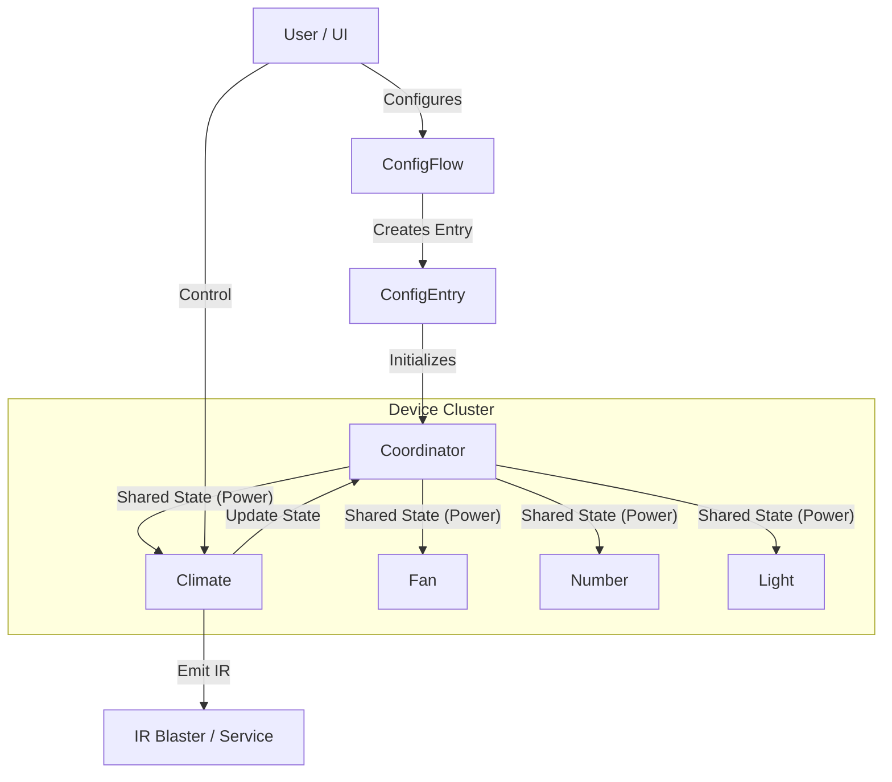

# RewIRe Architecture

This document describes the architecture and implementation details of the **RewIRe** Home Assistant integration. RewIRe allows users to create virtual devices (Climate, Fan, Light, etc.) that control physical devices via an IR blaster (or any other service that accepts a payload).

## Core Architecture

RewIRe follows the standard Home Assistant integration structure:

1.  **Config Flow (`config_flow.py`)**: Handles user input to define the device type, IR codes, and blaster configuration.
2.  **Coordinator (`coordinator.py`)**: A centralized `DataUpdateCoordinator` that maintains the shared state of the device (Power, Speed, etc.).
3.  **Platforms**: Specialized entities (`climate.py`, `fan.py`, `light.py`, `number.py`, `button.py`, `switch.py`) that expose controls to Home Assistant.
4.  **Base Entity (`entity.py`)**: A common base class that connects all entities to the coordinator and handles `device_info`.

### Data Flow

## Configuration Flow (`config_flow.py`)

The config flow is designed to be dynamic and user-friendly.

### Steps
1.  **User Step**: Collects the device name and type (AC, Fan, Light, Other).
2.  **Blaster Device**: User selects the target device (e.g., `remote.broadlink`).
3.  **Blaster Action**: User defines *how* to send the code (e.g., calling `remote.send_command` or publishing to `mqtt`). A placeholder `IR_CODE` is used in the data payload.
4.  **Configure [Device]**: Based on the selected type, specific schemas are shown:
    *   **AC (`configure_climate`)**: Power On/Off, Temp Inc/Dec, Temp Range (Min/Max), Temp Step, Fan Speed codes/range.
    *   **Fan (`configure_fan`)**: Power On/Off, Oscillate, Speed Inc/Dec, Speed Range.
    *   **Light (`configure_light`)**: Power On/Off, Brightness Inc/Dec.
5.  **Actions (Other)**: For generic devices, users can define custom buttons, switches, or toggles.

### Selectors and Translations
- Uses `selector.SelectSelector` with `translation_key` for device types to ensure localized labels.
- Uses `strings.json` and `translations/en.json` to provide human-readable names for all configuration keys.

## Coordinator & Shared State (`coordinator.py`)

Since IR control is "fire-and-forget" (open loop), the integration must maintain its own state. The **Coordinator**:
- Acts as the "source of truth" for the device's logical state (`power`, `speed`, etc.).
- Allows separate entities (e.g., a `Climate` entity and a `Number` selector for fan speed) to stay in sync.
- **Power State Sync**: When the AC is turned off via the `Climate` entity, the coordinator state is updated to `power: False`. The `Number` entity listens to this and automatically sets `available = False`.

## Platform Implementations

### Climate (`climate.py`)
- **Type**: `AC` devices.
- **Features**: Target Temperature, Fan Mode (optional).
- **Logic**:
    - **One-Step Restriction**: Temperature adjustments are restricted to one step per API call to ensure IR sync.
    - **Dynamic UI**: Uses `supported_features` property to dynamically disable `TARGET_TEMPERATURE` and `FAN_MODE` when `hvac_mode` is `OFF`.
    - **Unit Support**: Respects system temperature units (C/F).

### Fan (`fan.py`)
- **Type**: `Fan` devices.
- **Features**: Power, Oscillate, Speed (Percentage).
- **Logic**:
    - Maps 0-100% percentage to a configurable integer range (e.g., 1-10 speeds).
    - Enforces one-step increments/decrements for speed changes.

### Number (`number.py`)
- **Usage**:
    - Generic "Increment/Decrement" controls.
    - **AC Fan Speed**: Automatically created for AC devices to provide a dedicated numeric dial/slider for fan speed.
- **Logic**:
    - **Availability**: Checks coordinator power state for AC devices to disable itself when OFF.
    - **One-Step**: Restricted to single-step changes to match IR pulses.

### Light (`light.py`)
- **Type**: `Light` devices.
- **Features**: On/Off, Brightness.
- **Logic**: Similar step-based logic for brightness control.

### Button (`button.py`) & Switch (`switch.py`)
- **Usage**: General stateless buttons (Power, Mute) or stateful toggles.
- **Implementation**: Wraps simple IR code execution.

## IR Emission Logic (`entity.py` / Platforms)

To ensure reliability, especially with multi-step operations (e.g., increasing temp by 5 degrees), the IR emission logic (`_send_code`) is standardized:

1.  **Template Injection**: The target IR code is injected into the user-defined payload (replacing `IR_CODE`).
2.  **Delays**: If multiple repeats are requested (though now restricted largely to 1), a robust delay (e.g., `0.3s`) is inserted between calls to prevent command flooding.
3.  **Error Handling**: Catches and logs errors during service calls to prevent integration crashes.

## Localization & File Structure

- **`strings.json`**: Defines the source strings for config steps, errors, and selectors.
- **`translations/en.json`**: Generated/Synced translation file used by Home Assistant.
- **`manifest.json`**: Defines dependencies, code owners, and integration metadata.
